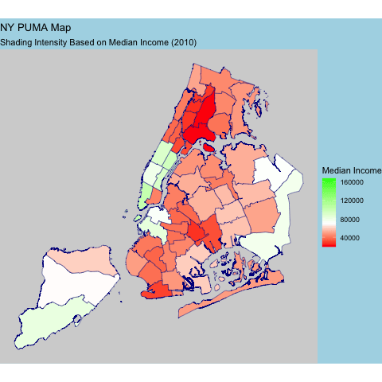

# ACS PUMA Choropleth

## About
This project was done in R, utilizing data from the yearly ACS data to generate maps of each of the 50 states. The code splits the state into the PUMA regions, and shades in the region based on its median income. 

More specifically, this project provides the files `api_utils.R` and `plot_utils.R` which serve as a starting point to plot any quantifiable metric that can be obtained from the census ACS data points!

## Setup

As a **prerequisite**, you must have R configured and installed (this project was done in R version 4.4.1 (2024-06-14)).

Steps:

1. `https://github.com/turtlelazy/acs-puma-choropleths.git`
2. `cd money-map`
3. `R`
4. You should now be in the R console. Proceed with the following
5. `install.packages("renv")`
6. `Selection: 1`
7. `q()` (Select y for saving the workspace)
8. `Rscript demo.R NY` (you can do whatever state you want, as long as it is the 2 letter abbreviation)

After running that process, you should have an animated gif called `NY_animated_map.gif` (or of whatever state you did). If so, you're good to go!

## util File Notes + Breadcrumbs
* Check the util files for function details
* The census api is a bit messy. Expirement with the different endpoints.
* The particular endpoint being used in this project suffers a change in parameter meaning including and after the year 2017. You'll notice that the function `generate_puma_df_decade` in `api_utils.R` has **two** query parameters. This is because the query parameters and their definitions changed. Check the ACS API docs for more information.
* The shapefiles from tigris are relatively accurate on the state scale, but for cities the quality suffers. For this, you may choose to download and input your own shapefile as input (and the parameters allow you to do so for that reason).
* Note that the **mean** is used as the middle point on the color scale for the plots, not the median. Up to you to change the scale and colors as you see fit